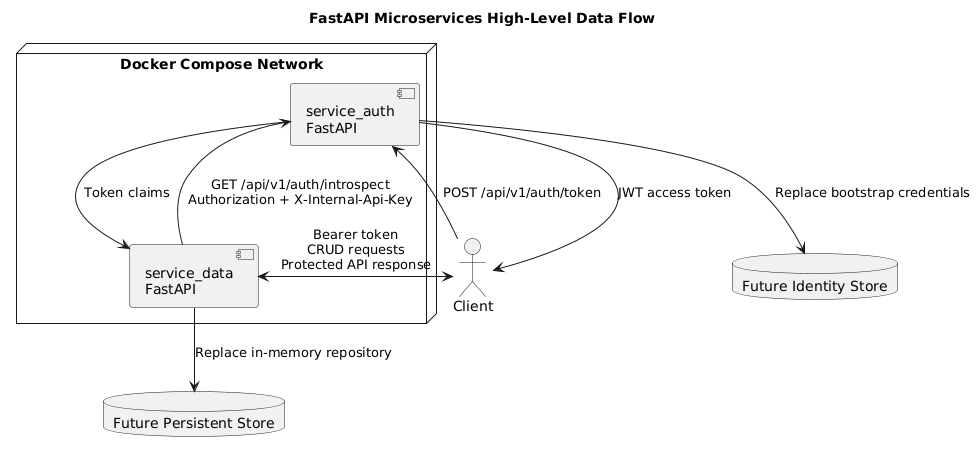
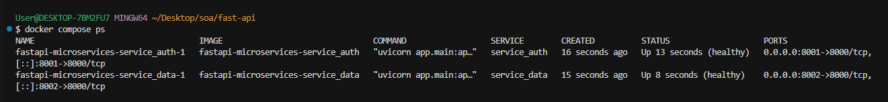
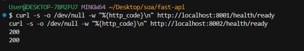
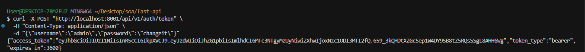
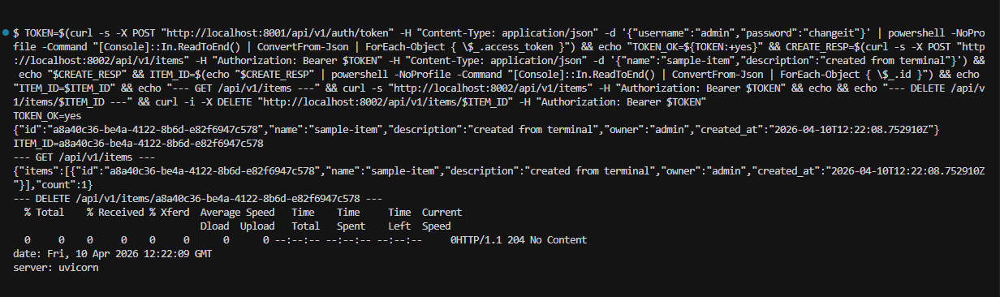

# FastAPI Microservices Project

This repository contains two Dockerized FastAPI microservices:

- `service_auth`: issues and validates JWT access tokens.
- `service_data`: exposes protected CRUD endpoints and validates bearer tokens through `service_auth`.

The project is intended for local deployment via Docker Compose on Windows, Linux, or macOS.

## Architecture Overview

- Each service ships as an independent FastAPI application with its own `Dockerfile`, dependencies, and app package.
- `service_auth` exposes public token issuance and internal token introspection endpoints.
- `service_data` keeps its domain logic behind a repository layer and calls `service_auth` for bearer token validation.
- Both services expose `/health/live` and `/health/ready` endpoints for orchestration and monitoring.

See [architecture.puml](architecture.puml) for the high-level data-flow diagram (PlantUML source; render with a PlantUML plugin or the official tooling).



## Compliance With Assignment

This project satisfies the assignment requirements:

- Simple microservices architecture with two independent Python services.
- Dockerized deployment using `docker-compose.yml` and per-service `Dockerfile`.
- Local deployment instructions and API usage examples.
- UML architecture model in `architecture.puml`.
- Project structure documented in this file.
- Working system validated by health checks and end-to-end API flow.

## Project Structure

```text
.
|-- .env.example
|-- .gitignore
|-- README.md
|-- architecture.puml
|-- docker-compose.yml
|-- service_auth
|   |-- .dockerignore
|   |-- Dockerfile
|   |-- requirements.txt
|   `-- app
|       |-- api
|       |-- core
|       |-- schemas
|       `-- services
`-- service_data
    |-- .dockerignore
    |-- Dockerfile
    |-- requirements.txt
    `-- app
        |-- api
        |-- clients
        |-- core
        |-- schemas
        `-- services
```

## Prerequisites

- Docker Engine 24+ or Docker Desktop with Compose support
- Optional: a local `.env` file derived from `.env.example` if you want to override defaults

## Getting Started

1. Review the default environment values in [`.env.example`](.env.example).
2. Optionally create a `.env` file in the repository root and adjust secrets, ports, or credentials.
3. Build and start the stack:

```bash
docker compose up --build -d
```

4. Check the running services:

```bash
docker compose ps
docker compose logs service_auth
docker compose logs service_data
```

5. Open the OpenAPI documentation:

- Auth service: `http://localhost:8001/docs`
- Data service: `http://localhost:8002/docs`

## Verify the stack

After `docker compose up --build -d`, both readiness endpoints should return HTTP 200:

```bash
curl -s -o /dev/null -w "%{http_code}\n" http://localhost:8001/health/ready
curl -s -o /dev/null -w "%{http_code}\n" http://localhost:8002/health/ready
```

Optional end-to-end smoke test:

1. Get token from `service_auth`
2. Create item in `service_data` with bearer token
3. List items and verify the created object is present
4. Delete the created item and verify `204 No Content`

## Third-Party Run Instructions

Any user can run this project on a clean machine with Docker Desktop installed:

1. Clone or unpack the project.
2. Open terminal in the project root.
3. Run:

```bash
docker compose up --build -d
```

4. Verify:

```bash
docker compose ps
curl -s -o /dev/null -w "%{http_code}\n" http://localhost:8001/health/ready
curl -s -o /dev/null -w "%{http_code}\n" http://localhost:8002/health/ready
```

5. Open API docs:
   - `http://localhost:8001/docs`
   - `http://localhost:8002/docs`

## Screenshots

### Screenshot 1 - Running Containers

Description: output of `docker compose ps` with both services in `Up` state.



### Screenshot 2 - Health Endpoints

Description: HTTP `200` for both readiness endpoints.



### Screenshot 3 - Token Issuance

Description: successful `POST /api/v1/auth/token` response with `access_token`.



### Screenshot 4 - Protected CRUD Flow

Description: create/list/delete item flow in `service_data` using bearer token.



## Service Endpoints

### `service_auth`

- `POST /api/v1/auth/token`
- `GET /api/v1/auth/introspect`
- `GET /health/live`
- `GET /health/ready`

### `service_data`

- `POST /api/v1/items`
- `GET /api/v1/items`
- `GET /api/v1/items/{item_id}`
- `DELETE /api/v1/items/{item_id}`
- `GET /health/live`
- `GET /health/ready`

## API Usage Examples

### 1. Request an Access Token

```bash
curl -X POST "http://localhost:8001/api/v1/auth/token" \
  -H "Content-Type: application/json" \
  -d "{\"username\":\"admin\",\"password\":\"changeit\"}"
```

Expected response shape:

```json
{
  "access_token": "<jwt>",
  "token_type": "bearer",
  "expires_in": 3600
}
```

### 2. Create a Protected Item

```bash
curl -X POST "http://localhost:8002/api/v1/items" \
  -H "Authorization: Bearer <jwt>" \
  -H "Content-Type: application/json" \
  -d "{\"name\":\"sample-item\",\"description\":\"created through the data service\"}"
```

### 3. List Your Items

```bash
curl "http://localhost:8002/api/v1/items" \
  -H "Authorization: Bearer <jwt>"
```

### 4. Validate a Token from Inside the Platform

This endpoint is intended for internal service-to-service communication and requires the shared internal API key.

```bash
curl "http://localhost:8001/api/v1/auth/introspect" \
  -H "Authorization: Bearer <jwt>" \
  -H "X-Internal-Api-Key: internal-dev-key"
```

## Configuration

The most important environment variables are:

- `AUTH_BOOTSTRAP_USERNAME`: bootstrap username for the auth service
- `AUTH_BOOTSTRAP_PASSWORD`: bootstrap password for the auth service
- `AUTH_JWT_SECRET`: JWT signing secret used by `service_auth`
- `AUTH_ACCESS_TOKEN_TTL_MINUTES`: token lifetime
- `INTERNAL_API_KEY`: shared service-to-service key used for token introspection
- `AUTH_SERVICE_URL`: internal base URL used by `service_data`

## Notes

- The project separates configuration, routing, schemas, and service layers so the in-memory examples can be replaced with a real identity store and database without changing the API surface.
- `service_auth` currently uses bootstrap credentials for local development. Replace this with your user database, SSO provider, or IAM integration before going live.
- `service_data` uses an in-memory repository to keep the example self-contained. Swap it for a persistent adapter in `service_data/app/services/repository.py`.
- Container images run as non-root users and use multi-stage builds to keep the runtime image smaller and cleaner.

## Shutdown

```bash
docker compose down
```

